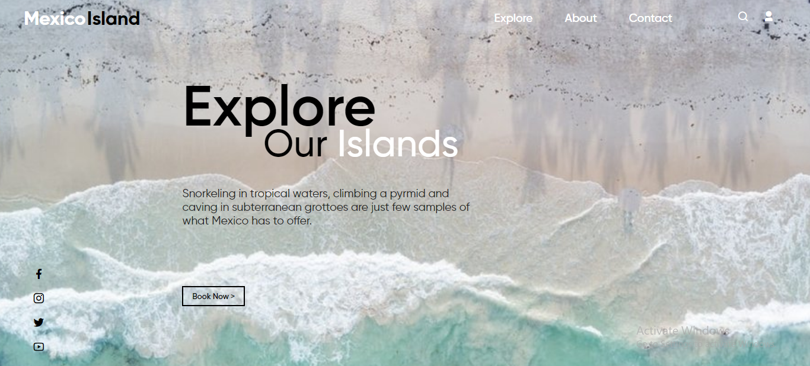

#  Hey floks, I have made a UI Design on Mexico Beach with a little bit of animation using Gsap.
## It was a nice experince while coding this.
## I hope you enjoy it
<i> This design is for Desktop responisve only. </i>

+ 

## 🔗 Links

## Support

If you like this project, please consider supporting it by giving a ⭐️.
